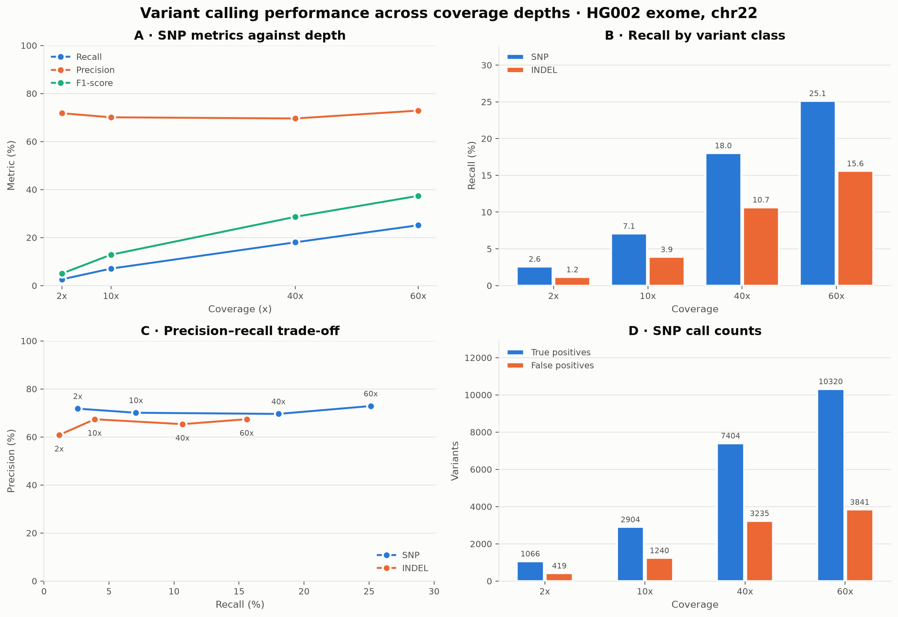
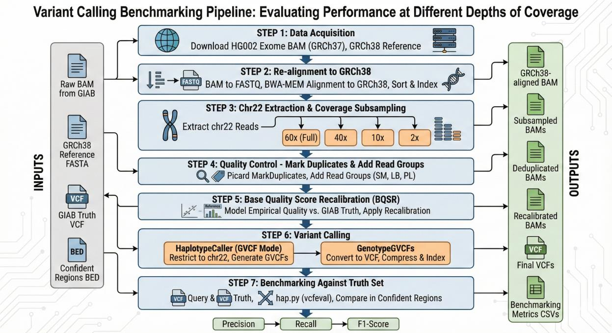

# Variant Calling Benchmarking Across Sequencing Depths

[](../../actions/workflows/shellcheck.yml)
[](LICENSE)
[](https://gatk.broadinstitute.org/)
[](https://github.com/Illumina/hap.py)

How much does sequencing depth actually buy you? This repository takes one
real whole-exome library — GIAB's HG002 — downsamples it to **2×, 10×, 40× and
60×**, runs each depth through the full GATK Best Practices pipeline, and scores
every call set against the GIAB v4.2.1 truth set with `hap.py`.

The short answer: **depth buys sensitivity, not accuracy.** Recall rises tenfold
from 2× to 60× while precision never moves outside a four-point band. The failure
mode of a shallow exome is silence, not noise — which matters clinically, because
it means a negative result is uninformative while a positive one stays reliable.

---

## Results



### SNPs

| Coverage | True positives | False positives | False negatives | Recall | Precision | F1 |
|---------:|---------------:|----------------:|----------------:|-------:|----------:|-----:|
| 2×  | 1,066  | 419   | 39,995 | 2.60%  | 71.78% | 5.01%  |
| 10× | 2,904  | 1,240 | 38,157 | 7.07%  | 70.08% | 12.85% |
| 40× | 7,404  | 3,235 | 33,657 | 18.03% | 69.59% | 28.64% |
| 60× | 10,320 | 3,841 | 30,741 | 25.13% | 72.88% | 37.38% |

### Indels

| Coverage | True positives | False positives | False negatives | Recall | Precision | F1 |
|---------:|---------------:|----------------:|----------------:|-------:|----------:|-----:|
| 2×  | 76    | 49  | 6,466 | 1.16%  | 60.80% | 2.28%  |
| 10× | 255   | 124 | 6,287 | 3.90%  | 67.37% | 7.37%  |
| 40× | 697   | 372 | 5,845 | 10.65% | 65.33% | 18.32% |
| 60× | 1,020 | 496 | 5,522 | 15.59% | 67.39% | 25.32% |

Truth set totals: 41,061 SNPs and 6,542 indels inside the GIAB high-confidence
regions of chr22.

### What the numbers say

- **Recall scales with depth; precision does not.** A 30-fold increase in depth
  multiplies SNP recall by 9.7× and leaves precision within 69.6–72.9%. Reads you
  did not buy cost you variants you never see, not variants you get wrong.
- **Indels are consistently harder.** At every depth, indel recall runs roughly
  40% lower than SNP recall and indel precision 5–10 points lower — alignment
  ambiguity and homopolymer error, not coverage, are the binding constraint.
- **Returns diminish, but slowly.** Going 2×→10× recovers 1,838 extra true SNPs;
  40×→60× recovers 2,916 — more in absolute terms, but for 20× of extra
  sequencing instead of 8×. Per unit of depth the yield falls monotonically
  (see `results/figures/coverage_efficiency.png`).
- **Most SNP false positives are genotype errors, not spurious sites.** At 40×,
  2,213 of 3,235 false positives are `FP.gt` — right site, wrong genotype. The
  het/hom ratio of 0.52 against an expected 1.90 points at allele dropout in
  heterozygous positions.

<details>
<summary>All figures</summary>

| Figure | File |
|---|---|
| SNP metrics against depth | `results/figures/snp_performance_vs_coverage.png` |
| Recall, SNP versus indel | `results/figures/recall_snp_vs_indel.png` |
| F1, SNP versus indel | `results/figures/f1_snp_vs_indel.png` |
| Precision–recall trade-off | `results/figures/precision_recall.png` |
| Detection efficiency per 1× | `results/figures/coverage_efficiency.png` |
| Call-set composition (TP + FP) | `results/figures/variant_counts_stacked.png` |
| Metric heatmap | `results/figures/performance_heatmap.png` |
| Composite dashboard | `results/figures/dashboard.png` |

All eight are regenerated from the committed CSVs by
`analysis/plot_benchmarks.py` — none are hand-drawn. The only hand-made image in
the repository is the pipeline schematic, `docs/pipeline_workflow.png`.

</details>

---

## Pipeline



| Step | Script | What it does |
|---|---|---|
| 00 | `scripts/00_download_data.sh` | Fetch the HG002 exome BAM, GRCh38, and the GIAB v4.2.1 truth set |
| 01 | `scripts/01_realign_grch38.sh` | BAM → FASTQ → BWA-MEM realignment to GRCh38 |
| 02 | `scripts/02_subsample_coverage.sh` | Extract chr22, measure depth, build the 2×/10×/40×/60× series |
| 03 | `scripts/03_preprocess.sh` | Picard MarkDuplicates and read groups, per depth |
| 04 | `scripts/04_bqsr.sh` | Base quality score recalibration against dbSNP + Mills |
| 05 | `scripts/05_call_variants.sh` | HaplotypeCaller in GVCF mode, then GenotypeGVCFs |
| 06 | `scripts/06_benchmark_happy.sh` | `hap.py` + `vcfeval` against the truth set |
| 07 | `scripts/07_rerun_ontarget.sh` | **Correction:** re-score restricted to the capture target |

The source data is aligned to GRCh37 while the v4.2.1 benchmark is in GRCh38, so
step 01 realigns from scratch rather than lifting coordinates over — liftover
loses reads exactly in the rearranged regions where calling is hardest.

Duplicates are marked **after** subsampling (step 03, not before step 02), because
a downsampled library genuinely contains fewer duplicate pairs; marking first
would carry the full-depth duplicate rate into every shallow sample.

---

## Quickstart

### Requirements

- Linux or macOS, 8+ cores, **~200 GB free disk**, 16 GB RAM
- [Conda](https://docs.conda.io/) or [Mamba](https://mamba.readthedocs.io/)
- [Docker](https://www.docker.com/) — `hap.py` runs containerised

### Run it

```bash
git clone <this-repo>
cd NGS_Project

conda env create -f environment.yml
conda activate ngs-benchmarking

# Large intermediates land outside the repo. Point this wherever you have space.
export PROJECT_DIR=/scratch/ngs_benchmarking
export THREADS=16

./scripts/run_all.sh
```

Steps 00–06 run in order and then the figures are rebuilt. Expect **12–24 hours**
on 8 cores, dominated by BWA indexing, realignment, and HaplotypeCaller.

Every step detects its own completed outputs and skips them, so an interrupted
run resumes by re-invoking the same command. Individual steps can be run alone:

```bash
./scripts/run_all.sh 04 05 06     # just BQSR, calling, benchmarking
./scripts/05_call_variants.sh     # or invoke one directly
```

### Just the figures

The benchmarking tables are committed, so the analysis reproduces in seconds
without any of the sequencing data:

```bash
python analysis/plot_benchmarks.py
```

### The on-target correction

Step 07 is deliberately outside the default run because it needs an exome capture
BED that cannot be redistributed here (Agilent SureSelect Human All Exon v5
"Covered", from SureDesign, in GRCh38 coordinates):

```bash
export EXOME_TARGET_BED=/path/to/agilent_sureselect_v5_chr22.bed
./scripts/07_rerun_ontarget.sh
python analysis/plot_benchmarks.py \
    --results-dir results/happy_ontarget \
    --out-dir results/figures_ontarget
```

---

## Configuration

Every tunable lives in [`config.sh`](config.sh) and can be overridden from the
environment — no script needs editing:

| Variable | Default | Purpose |
|---|---|---|
| `PROJECT_DIR` | `~/ngs_benchmarking_work` | Where large intermediates go |
| `THREADS` | `8` | Parallelism for BWA, samtools, hap.py |
| `GATK_JAVA_OPTS` | `-Xmx10G` | JVM heap for GATK |
| `CHROM` | `chr22` | Chromosome to analyse |
| `DEPTHS` | `(2 10 40 60)` | Coverage series to build |
| `SUBSAMPLE_SEED` | `42` | Fixed seed, so subsampling reproduces |
| `EXOME_TARGET_BED` | *(unset)* | Capture BED for step 07 |
| `BQSR_ALLOW_TRUTH_AS_KNOWN_SITES` | `0` | Set to `1` to reproduce the original circular BQSR |

Subsampling fractions are **derived at run time** from the measured full-coverage
depth rather than hard-coded, so changing `DEPTHS` or the input data produces a
correct series without hand arithmetic.

---

## Repository layout

```
.
├── config.sh                      # every path and parameter, overridable from the environment
├── environment.yml                # conda environment
├── scripts/                       # the pipeline, one file per step
│   ├── 00_download_data.sh … 07_rerun_ontarget.sh
│   └── run_all.sh                 # orchestrator, resumable, per-step logs
├── analysis/
│   └── plot_benchmarks.py         # regenerates every figure from the CSVs
├── results/
│   ├── happy/summary/             # hap.py summary tables, one per depth
│   ├── happy/extended/            # full stratified hap.py output
│   ├── benchmark_summary.csv      # tidy roll-up of all depths
│   └── figures/                   # generated PNGs
└── docs/
    ├── report.pdf                 # the written report
    ├── project_brief.docx         # original task specification
    ├── pipeline_workflow.png      # pipeline schematic
    └── original_submission/       # the submitted script, unmodified
```

`docs/original_submission/` is kept verbatim as the academic record. The scripts
in `scripts/` are a restructured and corrected version of it; the behavioural
differences are described under [Limitations](#limitations).

---

## Limitations

**Recall is measured against the whole chromosome, not the capture target.**
`hap.py` was run with the GIAB high-confidence BED but no `--target-regions`, so
the denominator is every confident variant on chr22 — 41,061 SNPs across 30.8 Mb.
The input is a SureSelect v5 exome capture, which targets on the order of 1–2 Mb
of that. Variants in the untargeted remainder are unreachable at any depth, and
every one was counted as a false negative.

So the reported 25.13% SNP recall at 60× is not "the pipeline found a quarter of
the variants"; it is "the pipeline found a quarter of the variants on a
chromosome whose great majority was never sequenced." Two things in the results
confirm this is a denominator problem rather than a calling problem: precision
stays flat at 69.6–72.9% across a 30-fold change in depth, and the recall curve
is still climbing steeply at the deepest point with no sign of saturation.

`scripts/07_rerun_ontarget.sh` re-runs the comparison with `-T <capture BED>`,
which restricts the metrics to regions the assay can actually reach. **Precision,
and the SNP-versus-indel comparison, are unaffected by this issue** — precision's
denominator is the call set, not the truth set.

**BQSR originally used the benchmark truth set as its known-sites resource.** The
same VCF the pipeline is scored against was passed to `BaseRecalibrator`, which
makes the recalibration circular. `scripts/04_bqsr.sh` now defaults to dbSNP138 +
Mills; set `BQSR_ALLOW_TRUTH_AS_KNOWN_SITES=1` to reproduce the original.

**Other caveats.** The 60× point is the un-subsampled extraction rather than a
controlled level, so it cannot be reproduced by changing a parameter. Each depth
was subsampled once with one seed, so no metric carries a confidence interval. No
hard filtering or VQSR was applied, so `ALL` and `PASS` rows are identical and the
~70% precision is raw-call precision. Genotype concordance is present in
`results/happy/extended/` but is not surfaced in the figures — at 40×, 2,213 of
3,235 SNP false positives are `FP.gt`, meaning right position and wrong genotype.

---

## Data sources

| Resource | Source |
|---|---|
| HG002 whole-exome BAM | [GIAB AshkenazimTrio, Oslo University Hospital exome](https://ftp-trace.ncbi.nlm.nih.gov/giab/ftp/data/AshkenazimTrio/HG002_NA24385_son/OsloUniversityHospital_Exome/) |
| GRCh38 reference | [NCBI GCA_000001405.15, no-alt analysis set](https://ftp.ncbi.nlm.nih.gov/genomes/all/GCA/000/001/405/GCA_000001405.15_GRCh38/) |
| Truth set | [GIAB HG002 v4.2.1 benchmark](https://ftp-trace.ncbi.nlm.nih.gov/ReferenceSamples/giab/release/AshkenazimTrio/HG002_NA24385_son/NISTv4.2.1/GRCh38/) |
| Benchmarking method | Krusche et al., *Best practices for benchmarking germline small-variant calls in human genomes*, [Nat Biotechnol 37, 555–560 (2019)](https://www.nature.com/articles/s41587-019-0054-x) |

No sequencing data is redistributed here; `scripts/00_download_data.sh` fetches
everything from the original sources.

---

## Author

**Hossam Hatem Abdelmoghni** — CIT675 Advanced NGS, Nile University, Fall 2025.

Code is MIT-licensed (see [`LICENSE`](LICENSE)). The GIAB data and the GRCh38
reference carry their own terms from their respective sources.
